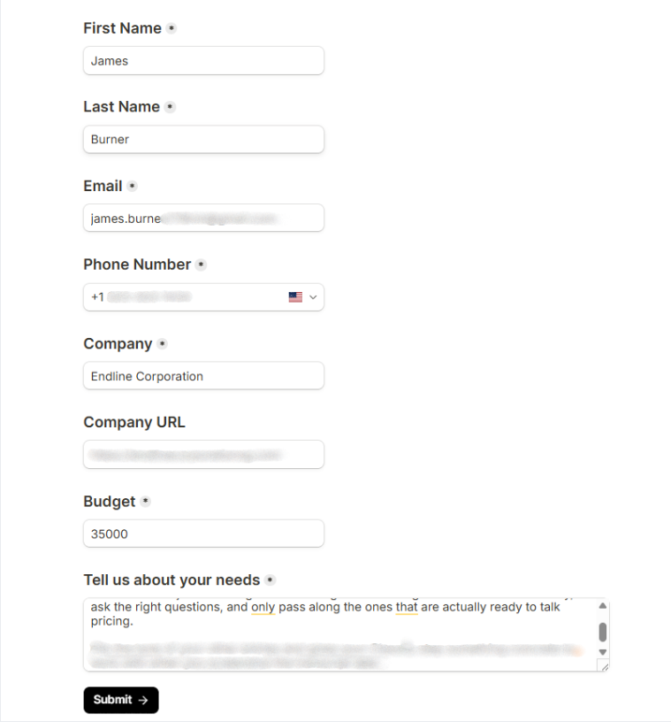
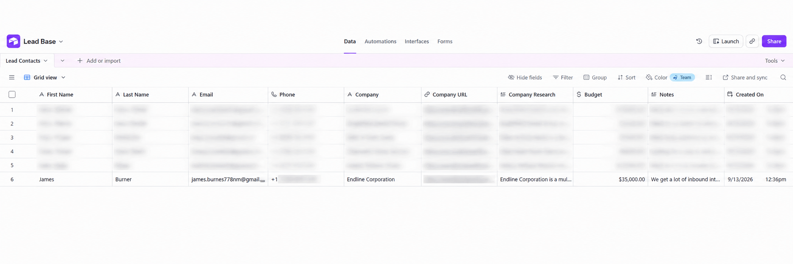
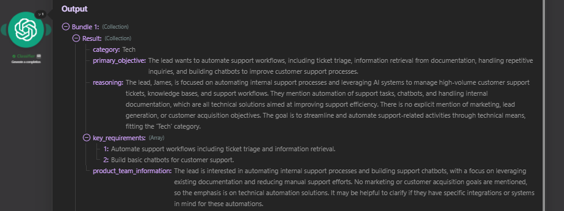
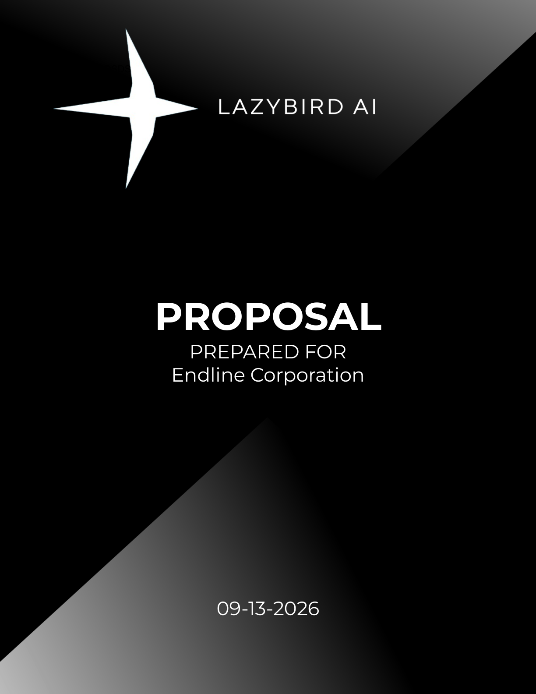
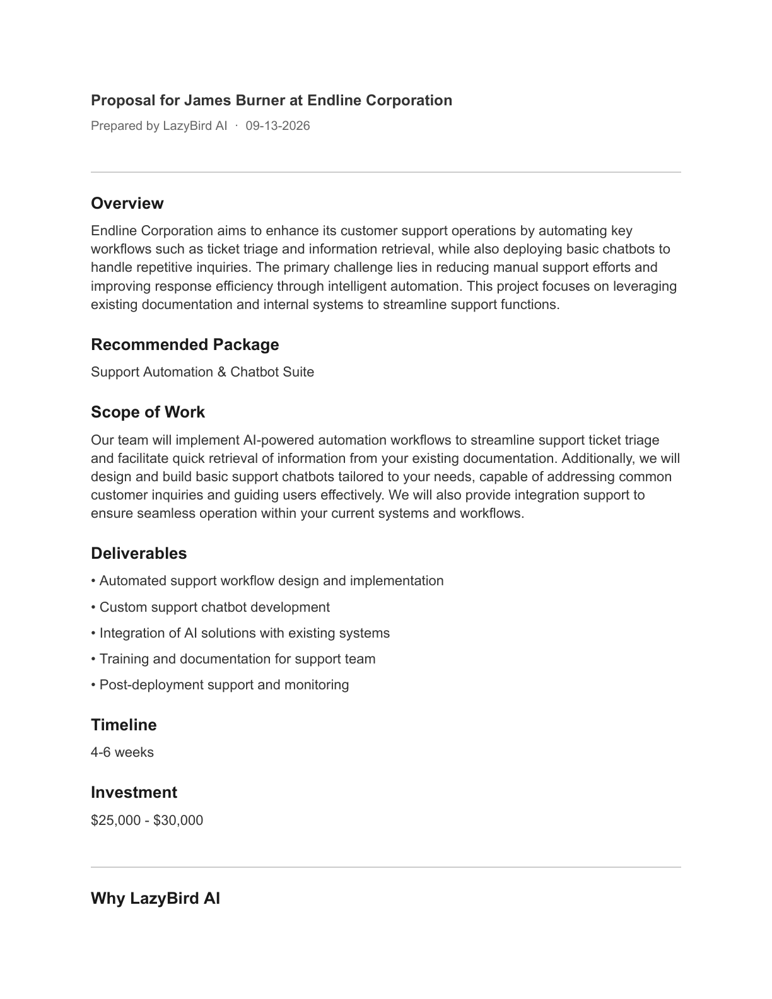
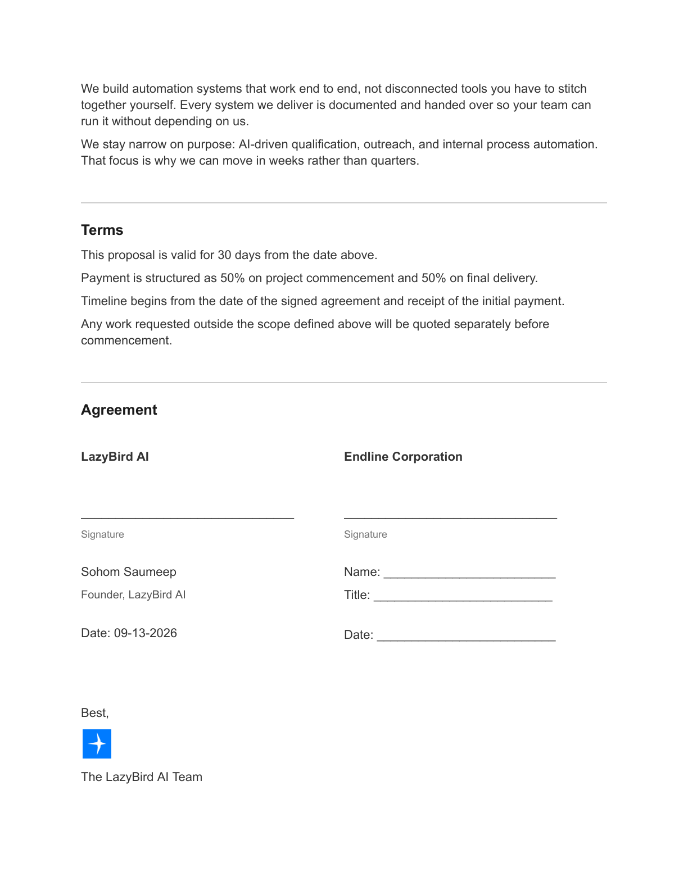
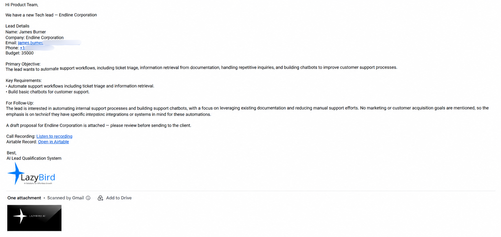
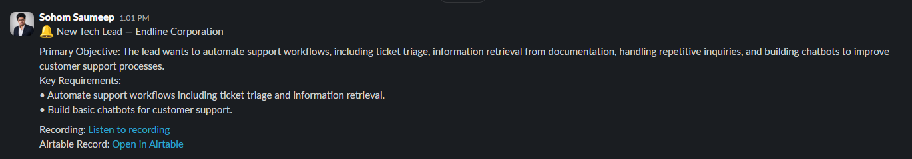

# AI Sales Engine

An AI automation system that qualifies inbound leads, calls them through a voice agent, and generates proposals automatically. Built with Make.com and Vapi.

## What it does

A lead submits an intake form. From there the system runs the entire qualification process on its own:

- **Research** — the lead's company is scraped and researched before any contact is made
- **Voice call** — an AI voice agent calls the lead and holds a live qualifying conversation about their needs
- **Call outcome handling** — when the call ends, Vapi posts an end-of-call report to a webhook, and the lead's record is updated based on whether the call was answered and whether the lead showed interest
- **Classification** — interested leads are classified as Marketing, Tech, or Mixed, with reasoning attached to the decision rather than just a label
- **Proposal generation** — proposal content is written from the conversation, merged into a Google Docs template, and downloaded as a PDF
- **Routing** — the product manager is emailed and the matching Slack channel is notified, with the call recording, the Airtable record, and the draft proposal attached for review
- **Follow-up** — leads that don't answer are emailed automatically and the team is notified, instead of being dropped

A human reviews every proposal before it reaches the client.

## Walkthrough

### The two scenarios

The system runs as two connected Make.com scenarios.

**Scenario 1 — qualify and call.** Picks up a new lead, researches the company, prepares the voice agent, and places the outbound call.

**Scenario 2 — call outcome and routing.** Triggered by a webhook carrying Vapi's end-of-call report. Updates Airtable, branches on the call outcome, classifies qualified leads, generates the proposal, and routes the notification to the right team.

### 1) Lead intake

A new lead comes in through the intake form and lands in the lead base. The pipeline only picks up leads marked as qualified, so unqualified submissions never trigger a call.

### 2) Research

The lead's company is researched automatically and the findings are written back to the lead record, so the voice agent goes into the call with context.

### 3) The voice call

An AI voice agent calls the lead and holds a live conversation to understand their needs. When the call ends, the end-of-call report triggers the second scenario.

### 4) Classification

Interested leads are classified as Marketing, Tech, or Mixed — with the reasoning behind the decision attached, not just the label.

### 5) Proposal generated

Proposal content is written from the conversation, merged into a Google Docs template, and downloaded as a PDF.

  
  
  

The full generated proposal is included as a PDF: [`samples/proposal.pdf`](samples/proposal.pdf).

### 6) Team notified

Based on the classification, the product manager is emailed and the matching Slack channel — marketing, tech, or mixed — is notified, with the call recording, the lead record, and the draft proposal attached for review.

## How it works in detail

For the module-by-module breakdown of both scenarios, including the branching logic and how the two scenarios stay linked across the call, see [`docs/how-it-works.md`](docs/how-it-works.md).

## Blueprints

The actual Make.com scenario exports, not just a description of them — sanitized and importable directly into Make. See [`blueprints/`](blueprints/).

## Stack

Make.com, Firecrawl, Vapi, OpenAI, Google Docs, Airtable, Gmail, Slack.

## Notes

This is a demo build using fabricated test data, not connected to a live production pipeline. It is built to show the architecture and reasoning behind a real lead qualification system, using the same tools and logic that would run in production.

## Author

Built by Sohom Saumeep, an AI automation engineer working with Make.com, n8n, Vapi, and voice AI systems.
