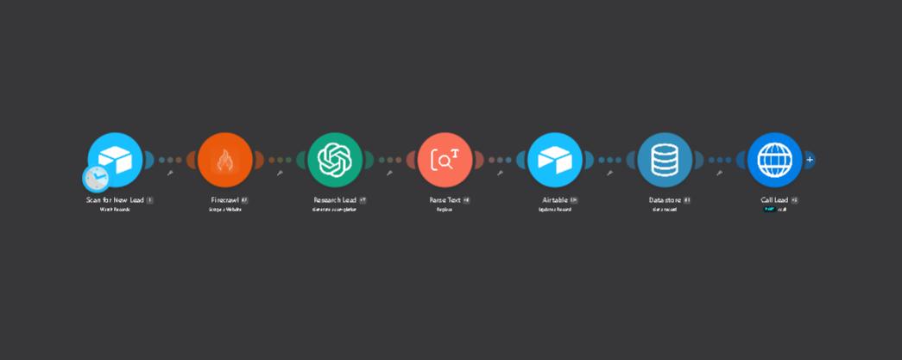
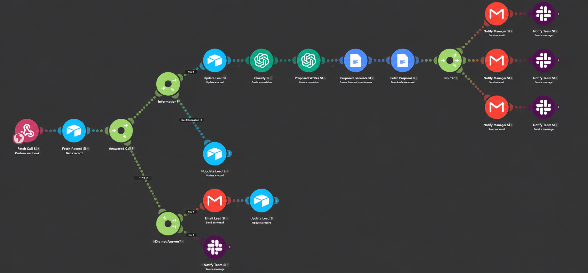

# How it works

A module-by-module breakdown of both Make.com scenarios, the branching logic, and how the two scenarios stay linked across the call.

---

## Scenario 1 — Research & Call Trigger



| # | Module | What it does |
|---|--------|--------------|
| 1 | **Scan for New Lead** (Airtable — watch records) | Watches the Lead Contacts table, filtered by the formula `{Qualification} = "qualified"`. Only leads that clear intake qualification enter the pipeline; everything else sits in the base untouched. |
| 2 | **Firecrawl** (scrape a website) | Scrapes the lead's Company URL to markdown, main content only, ads blocked, with a 48-hour cache window so repeat runs against the same domain don't re-scrape. |
| 3 | **Research Lead** (OpenAI — chat completion) | Turns the scraped page plus the lead's own notes into a single spoken-language paragraph: what the company does, their pain points and goals, and where automation fits. The prompt forbids citations, URLs and invented facts — the output is going into a phone call, not a document. |
| 4 | **Parse Text** (regex replace) | Strips markdown links and line breaks with `\(\[[^\]]+\]\(https?://[^)]+\)\)\|[\r\n]+`. Model output that is fine on a page reads badly when spoken and breaks when injected into a JSON request body, so it is cleaned once here and reused everywhere downstream. |
| 5 | **Airtable** (update a record) | Writes the cleaned research into the lead's Company Research field. The record, not the run, holds the context. |
| 6 | **Data store** (get a record) | Reads the Vapi API key from the key `vapi-api-key`. The key is fetched at runtime instead of being pasted into the HTTP module, so it is never sitting in the scenario body or in an exported blueprint. |
| 7 | **Call Lead** (HTTP — `POST https://api.vapi.ai/call`) | Places the outbound call. `assistantOverrides.variableValues` carries `firstName`, `company` and `companyResearch` into the agent's prompt, and `metadata.airtableRecordId` carries the lead's record ID — see [Linking the two scenarios](#linking-the-two-scenarios). |

The agent dials with the company research already in its prompt. That is the reason the research happens before the call rather than after: the qualifying conversation can be specific from the first sentence instead of opening with generic discovery.

---

## Scenario 2 — Call Result & Follow-Up



### Trigger and lookup

| # | Module | What it does |
|---|--------|--------------|
| 1 | **Fetch Call** (custom webhook) | Receives Vapi's end-of-call report: `endedReason`, transcript, recording URLs, the agent's structured outputs, and the call metadata. |
| 2 | **Fetch Record** (Airtable — get a record) | Loads the lead using `call.metadata.airtableRecordId` from the report. |

### Branch 1 — Answered Call?

The first router splits on `endedReason`.

#### Answered (`endedReason ≠ customer-did-not-answer`) → Interested?

Interest is not re-derived from the transcript here. The voice agent produces a **structured output** during the call — a boolean for interest, and a text summary — and the second router filters on that boolean.

**Interested (`true`):**

| Module | What it does |
|--------|--------------|
| **Update Lead** (Airtable) | Sets Interested to true, and writes Contacted On, the call recording URL, and the agent's call summary to the record. |
| **Classifier** (OpenAI, `gpt-4.1-nano`, JSON mode) | Classifies the lead as **Marketing**, **Tech**, or **Mixed** from the transcript, returning JSON: `category`, `primary_objective`, `reasoning`, `key_requirements[]`, and `product_team_information`. The prompt draws the line at the *business objective*, not the technology: AI used to generate leads is Marketing, because the technology is the method and acquisition is the goal. Mixed requires two genuinely separate objectives. |
| **Proposal Writer** (OpenAI, `gpt-4.1-nano`, JSON mode) | Takes the classifier's objective, requirements and notes and writes the proposal body: `package_name`, `overview`, `scope`, `deliverables[]`, `timeline`, and `price`. Price is required to be a range anchored to the lead's stated budget, never a single figure — a single number in an unreviewed draft reads as a quote. |
| **Proposal Generator** (Google Docs — create from template) | Merges those fields into the proposal template, deliverables joined into a bullet list. The layout is fixed by the template, so the model never controls the document's appearance. |
| **Fetch Proposal** (Google Docs — export) | Exports the document as a PDF, ready to attach. |
| **Router** | Splits into the marketing, tech and mixed paths on `category`. |
| **Notify Manager** (Gmail) | Emails the product manager: lead details, budget, primary objective, key requirements, follow-up notes, a link to the call recording, a link to the Airtable record, and the draft proposal attached. |
| **Notify Team** (Slack) | Posts the same summary to the matching channel — `marketing-team`, `tech-team`, or `mixed`. |

The proposal is generated automatically and **always reviewed by a human before it reaches the client** — the email says so explicitly. The automation produces the draft and puts it in front of the right person; it does not send it.

**Not interested (`false`):**

| Module | What it does |
|--------|--------------|
| **Update Lead** (Airtable) | Sets Interested to false and still writes Contacted On, the recording, and the call summary. A lead that said no is recorded as accurately as one that said yes; no proposal is generated and no team is pulled in. |

#### Not answered (`endedReason = customer-did-not-answer`) → Did not Answer

Both paths run:

| Path | What happens |
|------|--------------|
| **Email Lead** → **Update Lead** | The lead gets an automatic follow-up email with a booking link, and the record's Contacted On is stamped. |
| **Notify Team** (Slack) | The lead's intake message is posted to the `lead-follow-up` channel so a person can pick it up. |

Nothing is dropped silently. Every branch ends in an updated record, a follow-up, or a human being told.

---

## Linking the two scenarios

The two scenarios are separated by the call itself, which takes minutes. Scenario 1 ends the moment the call is placed; Scenario 2 starts when Vapi posts the end-of-call report. They are independent executions, so the second one has to work out which lead the call belonged to.

The link is the **Airtable record ID**, attached to the call in Scenario 1:

```json
"metadata": {
  "airtableRecordId": "{{1.id}}"
}
```

Vapi carries that metadata through the call and returns it in the end-of-call report, where Scenario 2 reads it back as `call.metadata.airtableRecordId` and loads the record. Every module downstream — the updates, the proposal, the notifications — operates on that one record.

The Airtable record is the single source of truth across both scenarios. No state is held in the run.

---

## Design notes

**Research before contact, not after.** The company is researched and the summary is loaded into the agent's prompt before it dials, so the conversation can be specific rather than generic discovery.

**Interest comes from the call, classification comes from the transcript.** The agent reports interest as a structured output while the call is happening; the category and reasoning are derived afterwards from the full transcript. Two different questions, answered where each is cheapest to answer well.

**Reasoning stored with the classification.** The classifier returns why it decided what it decided, plus anything ambiguous the product team should know. A bare label is not reviewable.

**Price as a range, layout from a template.** The model writes content into fixed slots and is constrained to a budget-anchored range. It never controls the document's look, and it never produces a figure that reads as a firm quote in a draft.

**Secrets in the data store.** The Vapi API key is read at runtime from a data store key rather than embedded in the HTTP module, so it stays out of the scenario body and out of any exported blueprint.

**Every branch terminates somewhere accountable.** Unanswered calls, uninterested leads, and every classification path end in a record update, an email, or a team notification.
